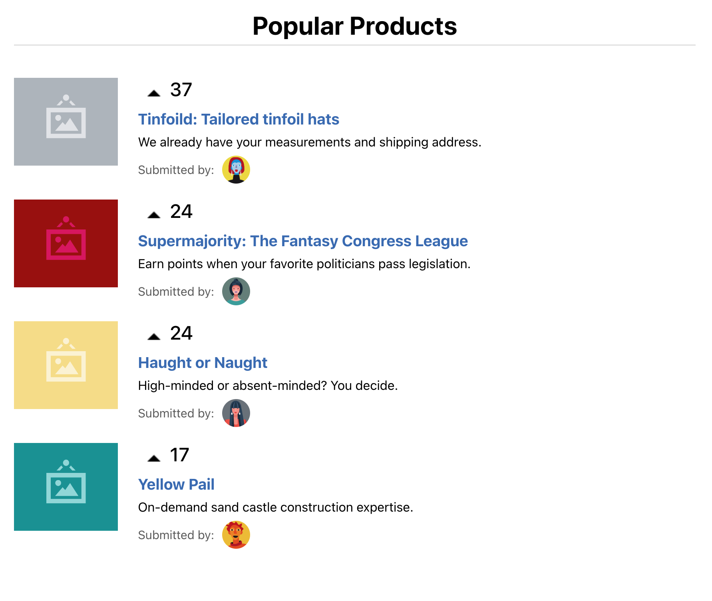
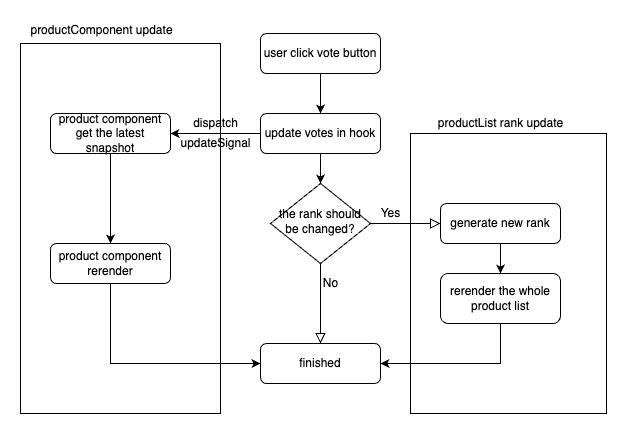

# Introduction

this demo is implemented by react.js + typescript. It was started from `create-react-app` with typescript template.

below is the extra library installed to support this project:

- events: for signal dispatching between different components.

# Start

run `npm install` or `pnpm i` before build or start this project.

after installing the `node_modules`, run `npm run start` to preview it locally under dev server or run `npm run build` to make a production build and serve it at your server.

# Test

run `npm run test` to test the app.

> if there is no file change, then the test will not be conducted by default. you can press 'a' to run all tests manually.

> the test code is in src/App.test.tsx.

# Project Design



> preview

In this demo, we are going to implement a page which contains a list of product info positioned in descending rank.

let's first define some types to make the discussion more clearly.

```typescript
type ProductInfo = {
  id: number
  title: string
  votes: number
  ...
}

type ProductInfoList = ProductInfo[]

type ProductComponent = React.FC<{id: number}>
```

The desired aims for this demo can be easily concluded as below:

1. the `ProductComponent` should be positioned by its `votes` in descending rank
2. the `ProductInfoList` should be rerendered only if the rank changed
3. when clicking the vote button and the rank remains the same, the only thing need to be updated is the `votes` of target `ProductComponent`

In a general and simple implementation, we can just maintain a `ProductInfoList` and render the product list by mapping them into component list like below:

```typescript
<div className="product-info-list">
  {productInfoList.map((product) => (
    <ProductComponent
      key={product.id}
      title={product.title}
      votes={product.votes}
      {...}
    />
  ))}
</div>
```

but in this case every time you update the `votes` of one product the `ProductInfoList` will also be updated **because** the `votes` is one field in `ProductInfo` and `ProductInfo` is the array element in `ProductInfoList`. so you will rerender everything on every time you click the vote button of any product. It's bad, and it doesn't meet the expectations we concluded before.

<!-- In this project, I made some optimization on reducing the render times of components. Currently there is no unnecessary rendering when you click the vote button of one product item, only the component you clicked will be rerendered during your interaction, and the whole list will not be rerendered **unless** the rank has changed. -->

With a deeper understanding of the aims above, we realize that we should separate these two operations, and this means `product info update` should be independent from `product rank update`, in which case when we update the product component the productList will not be affected.

To achieve this meticulous rendering control, we need:

- a method to let each component rerender itself independently.
- a more simple and product-info-free way to maintain the rank of product list.

_It's necessary to stress that if we want a component to rerender itself independently, then we **will not** make it a `pure/stateless component` because the component should take control of itself. This design somewhat disobeys the principle of what is considered a correct way to design a component, but I think it not that bad since we are aiming at achieving such a meticulous rendering control._

After several attempts and modifications, I designed the following routine for handling the feature:



In this routine, the `ProductList` is controlled by a simple `rankList` which only contains the number of product:

```typescript
type RankList = Array<number>

const rankList: RankList = [1,2,3,4]

// pages/product.tsx
<div className={"product-list"}>
  {rankList.map((product) => (
    <ProductItem id={product} key={product} {...} />
  ))}
</div>
```

so when we changed the `votes` of product the `rankList` will not be affected therefore will not be rerendered since it's not related with `votes`

There are two parts in this routine:

- left side showing the routine of `update product info(votes)`
- right side showing when rank changed and the `productList` rerender thoroughly

The right part is easy to implement since we just need to generate the correct rank for productList every time we update the votes of any product. when the rank should be updated, we return a new `rankList` and it drives the `ProductPage` to rerender the `ProductList`

The left part requires some in detailed explanation. the key part is **how to rerender single product component**, and we will achieve this by using an EventEmitter:

```typescript
// voteItem/index.tsx
const handleVoteCount = () => {
  updateVote(id, voteCount + 1);
};

// hook/index.tsx@useProductRankList
const updateVote = () => {
  ...
  // update product info first
  productStore.set(productId, { ...item, votes: vote });
  // then emit the signal to update component
  productUpdate$.emit(`product-update-${productId}`, productId);
  ...
}

// hook/index.tsx@useSubscribeProductItem
useEffect(() => {
  // receive the signal from context to fetch the latest snapshot
  productUpdate$.on(`product-update-${id}`, () => {
    setProduct(productStore.get(id))
  });
  ...
}, [...]);

// productItem/index.tsx
const ProductItem: React.FC = () => {
  // get the latest snapshot of `productInfo` from this hook.
  const product = useSubscribeProductItem(id);
  ...
}
```

By using an eventEmitter to dispatch the `updateSignal` and share the latest snapshot of `ProductInfo` in context, we can make it possible to only rerender the target product component.
